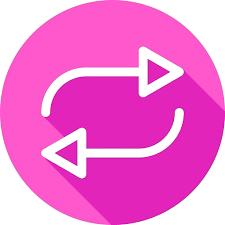

# Conversor de Moedas

Este projeto é uma aplicação web de conversão de moedas, desenvolvida com HTML, CSS e JavaScript. A interface permite que o usuário insira um valor e selecione moedas de origem e destino para realizar a conversão.

## Funcionalidades

- Entrada de valor para conversão
- Seleção da moeda de origem e moeda de destino
- Exibição do valor convertido
- Botão para converter o valor e outro para limpar o formulário

## Tecnologias Utilizadas

- **HTML5**: Estrutura básica da página.
- **CSS3**: Estilização e design responsivo.
- **Bootstrap 5**: Componentes estilizados e design responsivo.
- **JavaScript**: Lógica de conversão de moedas e integração com API de câmbio (a ser implementada).

## Como Utilizar

1. **Abrir a aplicação**: Abra o arquivo `index.html` em um navegador.
2. **Inserir o valor**: Digite o valor que deseja converter no campo de entrada.
3. **Selecionar moedas**: Escolha a moeda de origem e a moeda de destino.
4. **Converter**: Clique no botão **Converter** para realizar a conversão.
5. **Limpar formulário**: Clique no botão **Limpar** para redefinir o formulário.

## Estrutura do Projeto

- **index.html**: Estrutura da página e layout do formulário de conversão.
- **cont.css**: Estilos adicionais aplicados à página.
- **cont.js**: Lógica de conversão e manipulação do DOM.

## Requisitos

Para o correto funcionamento da aplicação, é recomendável o uso de um navegador moderno.

## Próximos Passos

- **Integração com API de câmbio**: Adicionar integração com uma API (como ExchangeRate-API ou Fixer.io) para obter taxas de câmbio atualizadas.
- **Mensagens de Erro**: Exibir mensagens de erro caso o valor inserido seja inválido ou se houver um problema com a API.

## Exemplo de Interface

A interface é composta por:
- Um campo de entrada para o valor a ser convertido.
- Seletor de moedas para a moeda de origem e moeda de destino.
- Botões para **Converter** e **Limpar** o formulário.

## Imagem do projeto

---

Este é um projeto simples para ajudar usuários a realizar conversões de moeda de maneira rápida e prática.